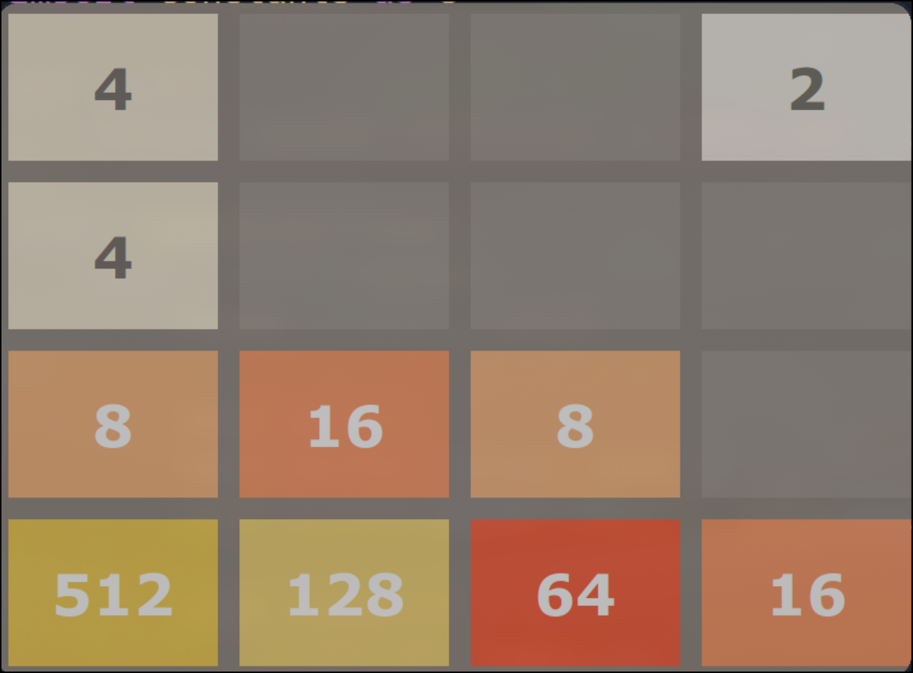

> 这次大家要完成一个2048小游戏的逻辑部分, 项目修改自 🇸🇬国立大学 CS1010FC课程内容


## 开始

你将会 学习/训练 (循环、变量、函数) 这些任何语言中共同的东西


??? example "效果图"
    


首先请从程序组群里下载项目，

- a版本: 比b少两道题, 适合爱循序渐进的同学
- b版本: 比a多两道题, 适合爱多学一点的同学

再用你的编辑器打开项目， 你只用修改 logic.py 文件
在logic.py文件中，一共有这几个问题

???+ success "TODO"

    - [ ] 如果表格中有任何一个数字为 2048 返回 'win'
    - [ ] 创建一个 n * n的二维度列表 
    - [ ] 左边的合并右边相邻且相同的数
    - [ ] 在表盘中随机添加一个2 
    选做
    - [ ] 反转列表
    - [ ] 创建转置矩阵(按主对角线对称)


## tips


列表的索引从0开始，意思是位置0

``` py

lis = ['apple', 'banana'] # 这样创建一个(一维)列表, 它的长度为2
# 索引     0         1

lis[0]  # ‘apple’

lis[1] # 'banana'

```

显然，你可以发现最后一个元素`banana`的索引是 列表的长度 - 1

!!! abstract 思考🤔 那么如何创建我们说的二维列表？ 
    这就像是我们会打出  xxxxxx
    当然也可以轻松打出
                    xxxxxx
                    xxxxxx
                    xxxxxx
    在代码中像是  lis1 = [0] * 4  # 就是创建 [0, 0, 0, 0]

                lis2 = [[0,0,0,0],
                 [0,0,0,0],
                 [0,0,0,0]]

``` py
lis1 = [0] * 4 # [0, 0, 0, 0]

lis2 = [[0,0,0,0],
        [0,0,0,0],
        [0,0,0,0]]

# 我们删除空格之后将其简写为
lis2_ = [[0,0,0,0], [0,0,0,0], [0,0,0,0]]

```

你或许已经发现了，这不就是连续三个一维列表吗？🤔

接下来介绍循环， 这样你可以执行一些相同的逻辑，并且指定次数

> 建议你在自己的编辑器中运行一下，看一下输出

```py

# 循环会执行3次，这种叫for循环
for i in range(3):
    print(i)

# 转换成人类语言，这段代码就是: 对于变量 i 在 范围 (3) 内循环执行 打印 i

```

看你的输出是不是和你想的一样

``` py

# 同样执行3次循环, 这种叫while循环
i = 0
while i < 3:
    print(i) 
    i += 1

```


